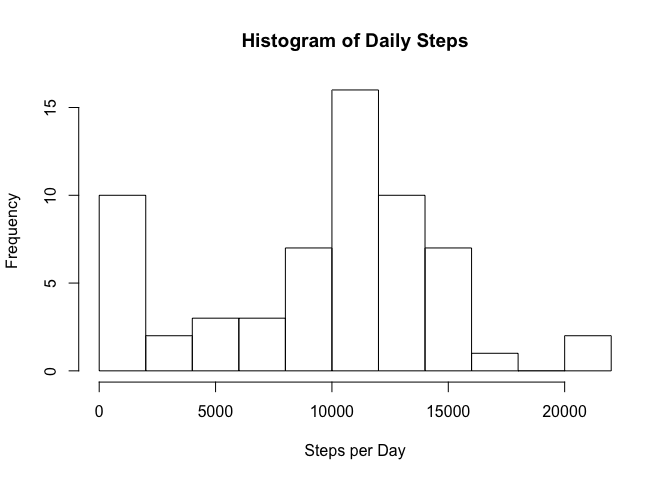
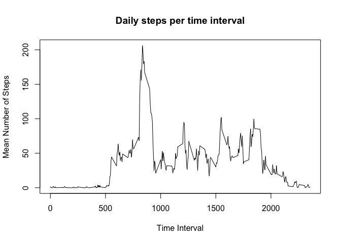

# Reproducible Research: Peer Assessment 1
This document is a simple R markdown document created to satisfy the requirements of an
assignment for the Coursera course "Reproducible Research" offered by the Johns Hopkins
Bloomberg School of Public Health. Each heading below represents a task in the assignment.

This assignment makes use of data from a personal activity monitoring
device. This device collects data at 5 minute intervals through out the
day. The data consists of two months of data from an anonymous
individual collected during the months of October and November, 2012
and include the number of steps taken in 5 minute intervals each day.

## Loading and preprocessing the data

We'll start by uncompressing the .zip archive that contains our data.

```r
unzip(zipfile = "activity.zip", overwrite = TRUE)
```

Load the data into R for analysis using the `read.csv` function.

```r
activity.data <- read.csv("activity.csv", stringsAsFactors = FALSE)
```

Convert the date variable to Date format.

```r
activity.data$date <- as.Date(activity.data$date)
```

## What is mean total number of steps taken per day?

Calculate the total number of steps taken per day (ignoring NA values).

```r
steps_per_day <- rowsum(activity.data$steps,group=activity.data$date,na.rm=TRUE)
```

Create a histogram of the total number of steps taken each day.

```r
hist(steps_per_day,breaks = 10, main="Histogram of Daily Steps", xlab="Steps per Day")
```

 

Calculate the mean and median of the total number of steps taken per day.

```r
steps_mean <- mean(steps_per_day)
steps_median <- median(steps_per_day)
```

The mean number of steps per day was 9354.23, while the median number of steps per day
was 10395.

## What is the average daily activity pattern?

Create a time series plot of the 5-minute interval (x-axis) and the average number of steps taken, averaged across all days (y-axis).

```r
interval <- unique(activity.data$interval)
steps_per_interval <- tapply(activity.data$steps, activity.data$interval, mean, na.rm = TRUE)
plot(interval, steps_per_interval, type = "l", main = "Daily steps per time interval",
     xlab = "Time Interval", ylab = "Mean Number of Steps")
```

 

We can determine which 5-minute time interval, on average across all days of in the dataset, contains the maximum number of steps.

```r
max_interval <- names(which.max(steps_per_interval))
```

The interval with the maximum number of steps was 835.

## Imputing missing values

Sorry, I ran out of time. Nothing to see here.

## Are there differences in activity patterns between weekdays and weekends?

Sorry, I ran out of time. Nothing to see here.
